---
## Front matter
lang: ru-RU
title: Лабораторная работа №1
author: Ильин Андрей Владимирович
institute: 2023, Москва
date: НФИбд-01-20

## Formatting
toc: false
slide_level: 2
theme: metropolis
header-includes: 
 - \metroset{progressbar=frametitle,sectionpage=progressbar,numbering=fraction}
 - '\makeatletter'
 - '\beamer@ignorenonframefalse'
 - '\makeatother'
aspectratio: 43
section-titles: true
---

# Введение

## Прагматика

Приобрести необхдимые в современном обществе разработчиков навыки.

## Цель

Создать каталоги для работы. Создать рабочее пространство для лабораторной работы. Создать репозиторий. Написать отчет, используя средства markdown.

## Задачи

1. Создать корректную локальную рабочую среду.
2. Подключить ее к системе контроля версий.
3. Описать выполнение задач в отчете, используя средства markdown.

# Выполнение

## Подготовка рабочей среды

   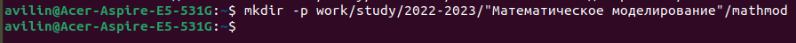

## Создание репозитория

   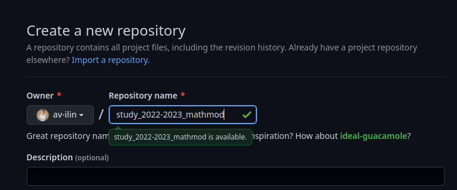

## Создание необходимых файлов 

   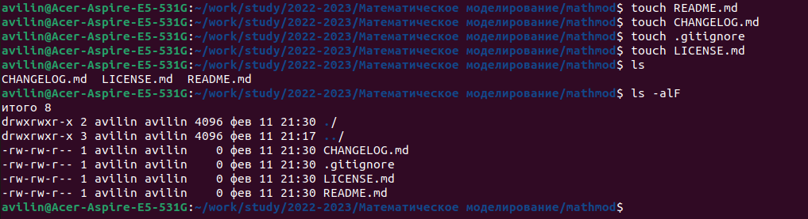

## .gitignore

   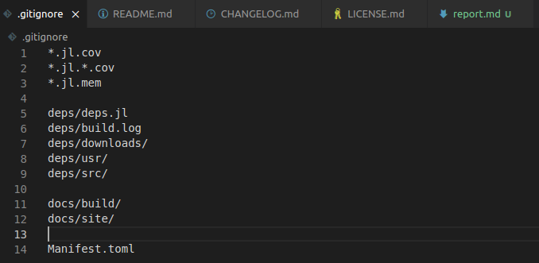

## Token

   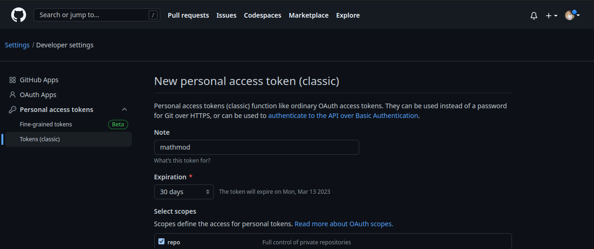

## Инициализируем git (1)

   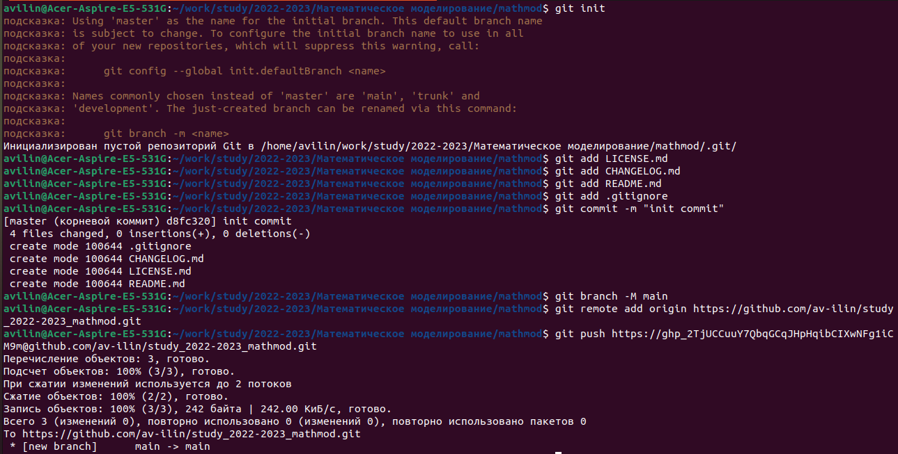

## Инициализируем git (2)

   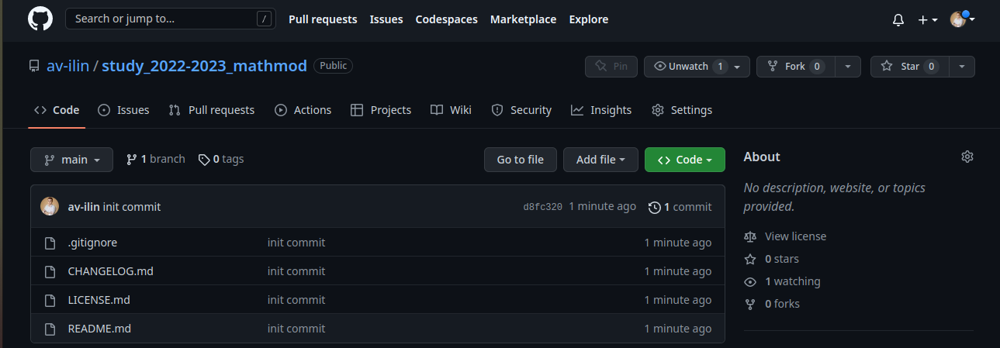

## Markdown (1)

   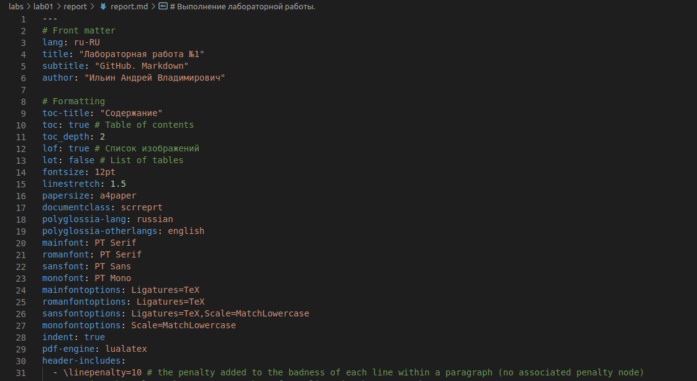

## Markdown (2)

   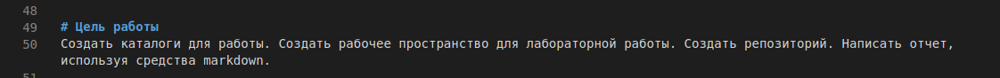

## Markdown (3)

   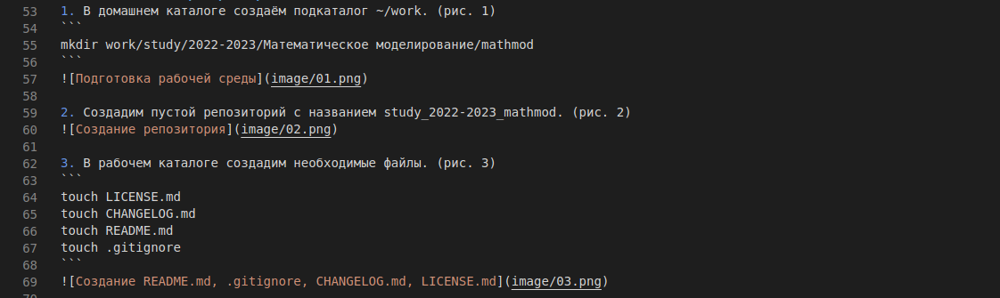

## Markdown (4)

   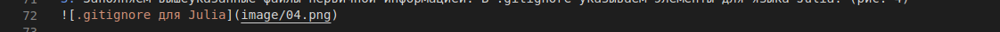

## Pandoc (1)

   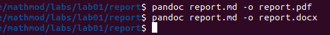

## Pandoc (2)

   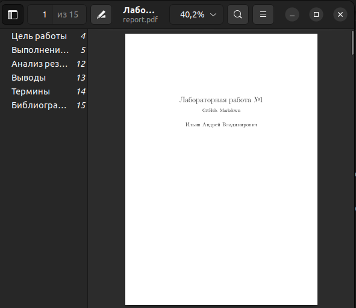

# Результаты

## Итог

Мы приобрели практические навыки работы с github и markdown. Создали репозиторий для хранения работ данной дисциплины.

## {.standout}

Спасибо за внимание!
