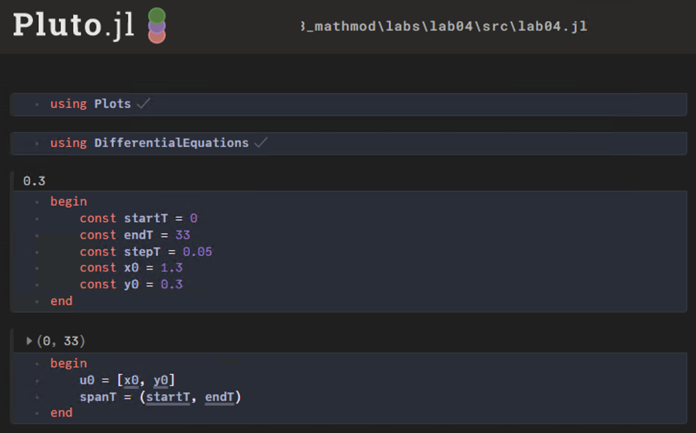
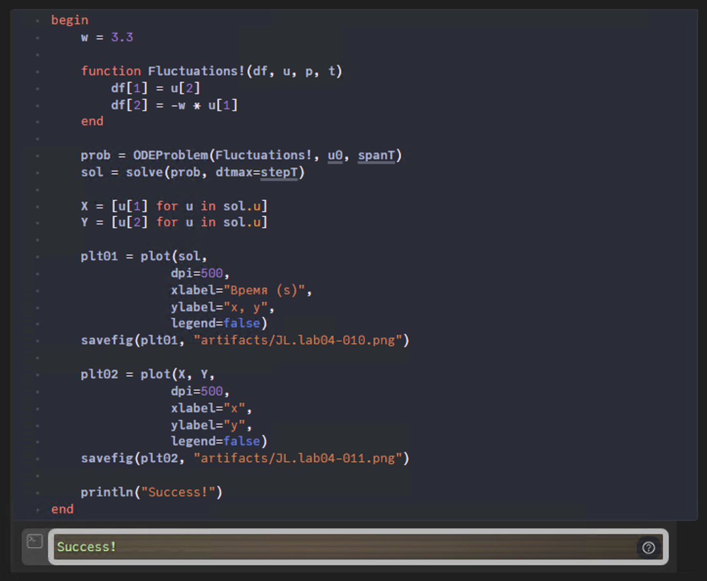

---
## Front matter
title: "Лабораторная работа №4"
subtitle: "Модель гармонических колебаний"
author: "Ильин Андрей Владимирович"

## Generic otions
lang: ru-RU
toc-title: "Содержание"

## Bibliography
bibliography: bib/cite.bib
csl: pandoc/csl/gost-r-7-0-5-2008-numeric.csl

## Pdf output format
toc: true # Table of contents
toc-depth: 2
lof: true # List of figures
lot: false # List of tables
fontsize: 12pt
linestretch: 1.5
papersize: a4
documentclass: scrreprt
## I18n polyglossia
polyglossia-lang:
  name: russian
  options:
	- spelling=modern
	- babelshorthands=true
polyglossia-otherlangs:
  name: english
## I18n babel
babel-lang: russian
babel-otherlangs: english
## Fonts
mainfont: PT Serif
romanfont: PT Serif
sansfont: PT Sans
monofont: PT Mono
mainfontoptions: Ligatures=TeX
romanfontoptions: Ligatures=TeX
sansfontoptions: Ligatures=TeX,Scale=MatchLowercase
monofontoptions: Scale=MatchLowercase,Scale=0.9
## Biblatex
biblatex: true
biblio-style: "gost-numeric"
biblatexoptions:
  - parentracker=true
  - backend=biber
  - hyperref=auto
  - language=auto
  - autolang=other*
  - citestyle=gost-numeric
## Pandoc-crossref LaTeX customization
figureTitle: "Рис."
tableTitle: "Таблица"
listingTitle: "Листинг"
lofTitle: "Список иллюстраций"
lotTitle: "Список таблиц"
lolTitle: "Листинги"
## Misc options
indent: true
header-includes:
  - \usepackage{indentfirst}
  - \usepackage{float} # keep figures where there are in the text
  - \floatplacement{figure}{H} # keep figures where there are in the text
---

# Цель работы

Рассмотреть уравнение гармонических колебаний. Построить модель гармонических колебаний средствами OpenModellica и Julia.

# Задачи

Построить фазовый портрет гармонического осциллятора и решение уравнения гармонического осциллятора для следующих случаев

1. Колебания гармонического осциллятора без затуханий и без действий внешней силы $\dot x + 3.3x = 0$.

2. Колебания гармонического осциллятора c затуханием и без действий внешней силы $\ddot x + 3\dot x + 0.3x = 0$.

3. Колебания гармонического осциллятора c затуханием и под действием внешней силы $\ddot x + 3.3\dot x + 0.3x = 3.3\sin(3t)$.

На интервале $t \in [0; 33]$ (шаг $0.05$) с начальными условиями $x_0 = 1.3, \ y_0 = 0.3$.

# Среда

-   Julia – это открытый свободный высокопроизводительный динамический язык высокого уровня, созданный специально для технических (математических) вычислений. Его синтаксис близок к синтаксису других сред технических вычислений, таких как Matlab и Octave. [@unn-julia]

-   OpenModelica — свободное открытое программное обеспечение для моделирования, симуляции, оптимизации и анализа сложных динамических систем. Основано на языке Modelica. [@wiki-om]

# Теоретическое введение

Движение грузика на пружинке, маятника, заряда в электрическом контуре, а также эволюция во времени многих систем в физике, химии, биологии и других науках при определенных предположениях можно описать одним и тем же дифференциальным уравнением, которое в теории колебаний выступает в качестве основной модели. [@rudn-task]

Эта модель называется линейным гармоническим осциллятором. Уравнение свободных колебаний гармонического осциллятора имеет следующий вид:

$$\ddot x + 2 \gamma \dot x + \omega_0^2 x = 0$$

где $x$ – переменная, описывающая состояние системы (смещение грузика, заряд конденсатора и т.д.), $\gamma$ – параметр, характеризующий потери энергии (трение в механической системе, сопротивление в контуре), $\omega_0$ – собственная частота колебаний, $t$ – время. (Обозначения $\ddot x = \frac{\partial^2x}{\partial^2t}$, $\dot x = \frac{\partial x}{\partial t}$)

При отсутствии потерь в системе вместо вышекуказанного уравнения получаем уравнение консервативного осциллятора энергия колебания которого сохраняется во времени

$$\ddot x + \omega_0^2x = 0$$

Для однозначной разрешимости уравнения второго порядка необходимо задать два начальных условия вида

$$
\left\{
\begin{array}{c}
x(t_0) = x_0
\\ \\
\dot x (t_0) = y_0
\end{array}
\right.
$$

Уравнение консервативного осциллятора энергия колебания которого сохраняется во времени можно представить в виде системы двух уравнений первого порядка:

$$
\left\{
\begin{array}{c}
\dot x = y
\\ \\
\dot y = - \omega_0^2x
\end{array}
\right.
$$

Начальные условия для системы примут вид:

$$
\left\{
\begin{array}{c}
x(t_0) = x_0
\\ \\
y (t_0) = y_0
\end{array}
\right.
$$

Независимые переменные $x$, $y$ определяют пространство, в котором «движется» решение. Это фазовое пространство системы, поскольку оно двумерно будем называть его фазовой плоскостью.

Значение фазовых координат $x$, $y$ в любой момент времени полностью определяет состояние системы. Решению уравнения движения как функции времени отвечает гладкая кривая в фазовой плоскости. Она называется фазовой траекторией. Если множество различных решений (соответствующих различным начальным условиям) изобразить на одной фазовой плоскости, возникает общая картина поведения системы. Такую картину, образованную набором фазовых траекторий, называют фазовым портретом.

# Выполнение лабораторной работы

1. Установим пакет в Julia необходимый для построения графиков (Plots) и работы с дифференциальными уравнениями (DifferentialEquations). (рис. @fig:001)

{#fig:001 width=86%}

2. Напишем скрипт для моделирования боевых действий между регулярными войсками. Первым делом подкючим пакеты "Plots" [@docs-plots] и "DifferentialEquations" [@docs-de], далее объявим начальные данные при помощи констант. После чего используя DifferentialEquations составим и решим систему однородных дифференциальных уравнений. В конце используем Plots для того чтобы построить модель. (рис. @fig:002, @fig:003)

```Julia
# подключение пакетов
using Plots
using DifferentialEquations

# начальные данные
const X = 44200
const Y = 54200
const a = 0.312
const b = 0.456
const c = 0.256
const h = 0.340
const P(t) = sin.(t + 3)
const Q(t) = cos.(t + 7)
const t_start = 0
const t_end = 2.16

# используем DifferentialEquations,
# чтобы описать и решить систему ОДУ
function Battle!(df, u, p, t)
    df[1] = -a * u[1] - b * u[2] + P(t);
    df[2] = -c * u[1] - h * u[2] + Q(t);
end
u0 = [X, Y]
tspan = (t_start, t_end)
prob = ODEProblem(Battle!, u0, tspan)
sol = solve(prob)

# используем Plots,
# чтобы построить график решения
plt = plot(sol,
          title="Модель боевых действий №1",
          dpi=500,
          label=["Армия №1" "Армия №2"],
          xlabel="Время (s)",
          ylabel="Численность")
savefig(plt, "artifacts/lab03-1_JL.png")
```

{#fig:002 width=86%}

{#fig:003 width=86%}

# Анализ результатов

Работа выполненна без непредвиденных проблем в соответствии с руководством. Ошибок и сбоев не произошло.

Моделирование на OMEdit было проще и быстрее, чем при использовании средств Julia. Скрипт на Modelica вышел более лакончиным, понятным и коротким. Более того OpenModelica быстрее обрабатывала скрипт и симмулировала модель. Стоит отметить, что OpenModelica имеет множество разлиных полезных инструментов для настройки с симмуляцией и работой с ней. К плюсам Julia можно отнести, что она является языком программирования, который хорошо подходит для математических и технических задач.

# Выводы

Мы улучшили практические навыки в области дифференциальных уравнений, улучшили навыки моделирования на Julia, также приобрели навыки моделирования на OpenModelica. Изучили модель гармонических колебаний.

# Список литературы{.unnumbered}

::: {#refs}
:::
