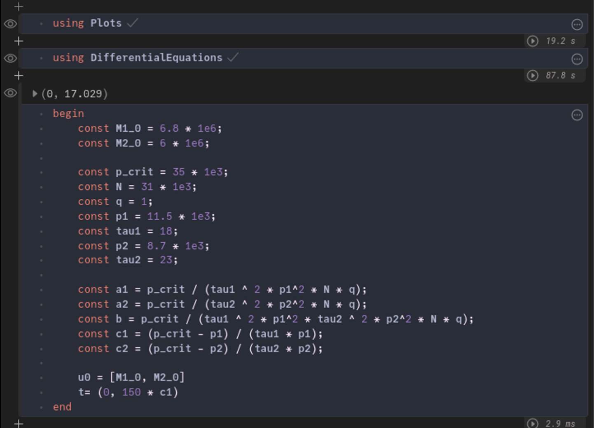
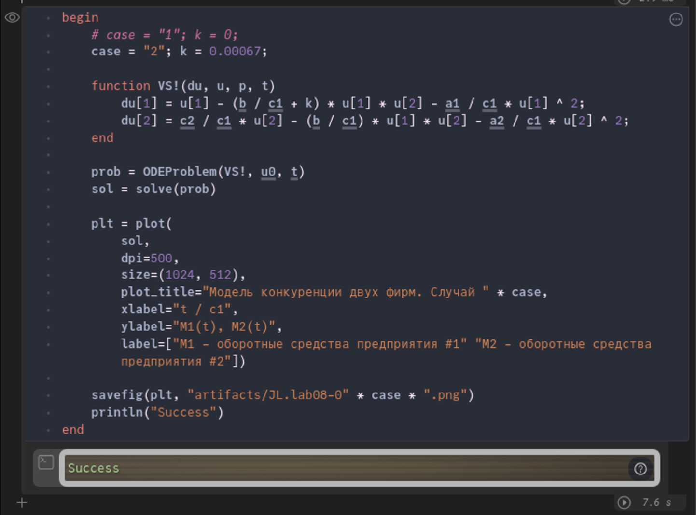

---
## Front matter
lang: ru-RU
title: Лабораторная работа №8
subtitle: Модель конкуренции двух фирм
author:
    - Ильин А.В.
institute:
    - Российский университет дружбы народов, Москва, Россия
date: 1 апреля 2023

## i18n babel
babel-lang: russian
babel-otherlangs: english

## Fonts
mainfont: PT Serif
romanfont: PT Serif
sansfont: PT Sans
monofont: PT Mono
mainfontoptions: Ligatures=TeX
romanfontoptions: Ligatures=TeX
sansfontoptions: Ligatures=TeX,Scale=MatchLowercase
monofontoptions: Scale=MatchLowercase,Scale=0.9

## Formatting pdf
toc: false
toc-title: Содержание
slide_level: 2
aspectratio: 169
section-titles: true
theme: metropolis
header-includes:
    - \metroset{progressbar=frametitle,sectionpage=progressbar,numbering=fraction}
    - '\makeatletter'
    - '\beamer@ignorenonframefalse'
    - '\makeatother'
---

# Информация

## Докладчик

:::::::::::::: {.columns align=center}
::: {.column width="70%"}

-   Ильин Андрей Владимирович
-   НФИбд-01-20
-   1032201656
-   Российский Университет Дружбы Народов
-   [1032201656@pfur.ru](mailto:1032201656@pfur.ru)
-   <https://github.com/av-ilin>

:::
::: {.column width="30%"}

:::
::::::::::::::

# Вводная часть

## Актуальность

-   Приобрести необхдимые в современном научном сообществе навыки моделирования задач.
-   Освоить средства моделирования, такие как Julia и OpenModelica

## Объект и предмет исследования

-   Язык программирования Julia
-   OpenModelica
-   модель распространения рекламы.

## Цель

-   Рассмотреть модель распространения рекламы.
-   Построить данную модель средствами OpenModellica и Julia.

## Задачи

Построить график распространения рекламы, математическая модель которой описывается следующим уравнением

1. $\frac{dn}{dt} = (0.133 + 0.000033n(t))(N - n(t))$
2. $\frac{dn}{dt} = (0.0000132 + 0.32n(t))(N - n(t))$
3. $\frac{dn}{dt} = (0.8t + 0.15\sin(t)n(t))(N - n(t))$

При этом объем аудитории $N = 1670$, в начальный момент о товаре знает 12 человек. Для случая 2 определить в какой момент времени скорость распространения рекламы будет иметь максимальное значение.

## Материалы и методы

-   Julia, Pluto
-   Modelica, OMEdit

# Выполнение работы

## Julia. Cкрипт (1)

## Julia. Cкрипт (2)

## Julia. Модель(1)

:::::::::::::: {.columns align=center}
::: {.column width="33%"}

:::
::: {.column width="33%"}

:::
::: {.column width="33%"}

:::
::::::::::::::

## Modellica. Cкрипт

## Modellica. Модель (1)

:::::::::::::: {.columns align=center}
::: {.column width="33%"}

:::
::: {.column width="33%"}

:::
::: {.column width="33%"}

:::
::::::::::::::

# Результаты

## Итог

Мы улучшили практические навыки в области дифференциальных уравнений, улучшили навыки моделирования на Julia, а также навыки моделирования на OpenModelica. Изучили и построили модель распространения рекламы.

## {.standout}

Спасибо за внимание!
